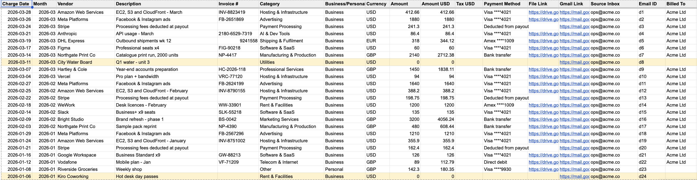
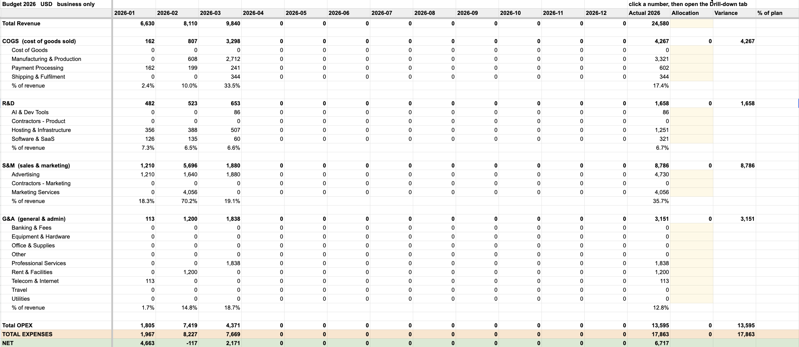
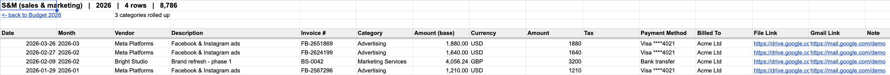

# Expense Agent

Your receipts are already in your inbox. This turns them into a ledger.

It reads a Gmail mailbox, uses Claude to work out what is a real expense, files
the invoice PDF in Drive, writes a row to a Google Sheet, and builds budget tabs
where every number is clickable down to the invoices behind it.

It runs entirely inside your own Google account as Apps Script. No server, no
hosting bill, no third party holding your mail. Two files to paste, about five
minutes.

## What it looks like

**The ledger.** One row per expense, newest first. The two highlighted rows are
ones the classifier wasn't sure about — that's the intended behaviour, not a bug.



**The budget.** P&L shaped, every cell a live `SUMIFS`, so it is never stale.
Column O is yours to type a plan into; variance and % of plan sit beside it.



**The drill-down.** Click any number above — a category, a section, a month, a
year, a total — and the exact invoices behind it appear here.



---

## Two ways to install

### With an agent (fastest)

Drop this folder into Claude Code, Cowork, or any coding agent and say:

> Set up Expense Agent for me.

It reads `SKILL.md`, asks you seven questions, generates your configured files,
and walks you through the clicks. If your agent doesn't pick up skills
automatically, paste `setup-prompt.md` instead — it works in any agent.

**New to this?** Read **[QUICKSTART.md](QUICKSTART.md)** instead — ten
minutes, every click spelled out, including how to tell it's working.

### By hand

1. Create a blank Google Sheet, and a Drive folder for the PDFs.
2. Open `scripts/expense-agent.gs` and fill in the `CONFIG` block at the top. Seven
   values, all commented.
3. script.google.com → **New project** → paste the file → save.
4. **Project Settings → Script properties** → add `ANTHROPIC_API_KEY` with your
   key from console.anthropic.com.
5. Back to the editor → **Run** → authorize (Advanced → Go to project → Allow).
6. Open your Sheet → **Extensions → Apps Script** → paste `scripts/drilldown.gs`
   → save. Reload the sheet.

Done. The backfill walks one month every five minutes and stops on its own.

---

## What you get

**Expenses tab** — date, vendor, description, invoice number, category,
business/personal, original currency and amount, converted amount, tax, payment
method, a link to the filed PDF, a link back to the email, who it was billed to,
and a note.

**Income tab** — payouts and settlements, recorded at **gross**, with the
processor's commission split out as a `Payment Processing` expense. Most tools
record the deposit, which quietly understates your revenue and hides your
processing costs.

**Budget 2026 / 2027** — a P&L-shaped view: revenue, COGS, R&D, S&M, G&A, %
of revenue per section, total OPEX, net. Every cell is a live `SUMIFS`, so it is
never stale. Column O is yours to type a plan into, with variance and % of plan
beside it — and a rebuild never overwrites it.

**Drill-down** — click any number on a budget tab and the exact rows behind it
appear in the `Drill-down` tab. Works on one category, a whole section, a whole
month, a whole year, and the roll-up totals.

**Drive** — `<your folder>/2026/2026-03/2026-03-14 Anthropic 20.00 USD #2180-6529.pdf`.
If an expense has no attachment, the email itself is rendered to PDF so there is
always a document.

---

## Design decisions worth knowing about

**The PDF goes to the model, not the email text.** Half of all invoice emails say
"your invoice is attached" and nothing more, and non-Latin invoices are often
unreadable as extracted text but perfectly readable as a rendered page. Sending
the file is the difference between working on your real mail and working on the
easy half of it.

**Two models.** A cheap fast one triages everything (expense / income / skip),
a stronger one only extracts the ones that matter. Most mail is skip, and skip
is where the volume is.

**Uncertainty is visible, not hidden.** If the model can't find an amount, or a
payout doesn't state its fee, the row is written anyway, flagged `NEEDS REVIEW`
in the Note, and painted yellow. It never guesses a number into your books. Your
manual fixes are never overwritten.

**Categories are a closed list.** The classifier picks from `CATS` and cannot
invent a name — it can only *suggest* one, in the Note. An open-ended classifier
gives you "Software", "SaaS", "Software subscription" and "Tools" for the same
four invoices, and a budget built on that is worthless.

**Never re-scan to fix classification.** `reclassify()` re-labels rows already in
the sheet without opening Gmail, re-reading a single PDF, or spending any Gmail
quota. Extraction is the expensive part; only the labelling changed.

**Two duplicate guards.** The Gmail message id in every row is authoritative — a
message already in the sheet is never processed twice, so re-scanning is always
safe. A Gmail label on every thread already looked at is the speed optimisation
that makes the daily run nearly free.

---

## Second mailbox

Common setup: a personal address and a company one. A Google account cannot read
another account's Gmail, so the second account runs its own copy in `satellite`
mode and posts finished rows to the first one's web app, authenticated by a
shared secret. It owns no data of its own.

The installer handles this. `reference/architecture.md` explains the shape, and
be aware the hub is deployed with "Anyone" access — protected only by that
secret. If that isn't acceptable to you, forward receipts to the first mailbox
instead.

---

## What it costs

Claude API only. A busy mailbox's full year backfill runs a few dollars; steady
state is cents a day, because triage is cheap and everything already seen is
excluded by label. Google charges nothing.

---

## Requirements

- A Google account with the mailbox you want to scan
- An Anthropic API key
- Nothing else

## Limits

- Apps Script gives 6 minutes per execution and a Gmail daily quota that is much
  smaller on consumer accounts than on Workspace. The backfill is chunked to stay
  well inside both.
- One business, one base currency.
- No accounting-software sync. The sheet is the product.
- Drill-down is two clicks, not one — Google does not let a selection trigger
  move your view.

---

## Files

```
QUICKSTART.md                10-minute setup, every click spelled out
SKILL.md                     installer instructions for an agent
setup-prompt.md              same thing, pasteable into any agent
scripts/expense-agent.gs            the main script — CONFIG block at the top
scripts/drilldown.gs         bound to the sheet, makes budget cells clickable
reference/architecture.md    how it fits together and why
reference/categories.md      the chart of accounts and how to change it
reference/troubleshooting.md every failure I have actually hit, and the fix
```

## Licence

MIT. Do what you like with it.
